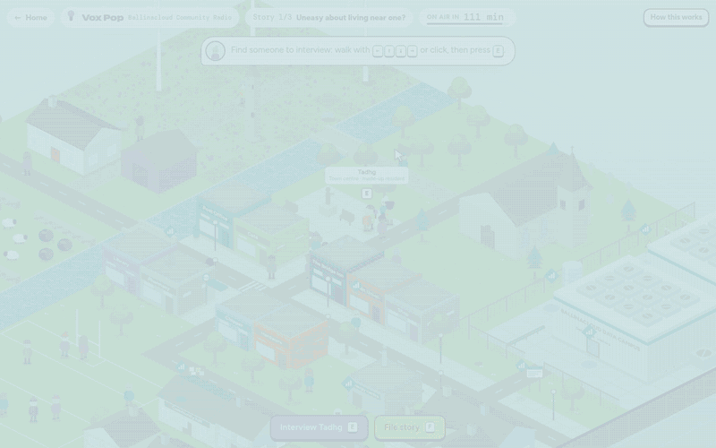
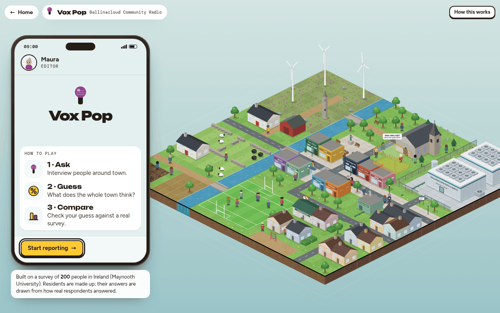
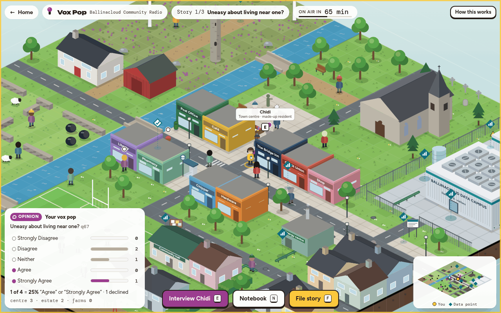
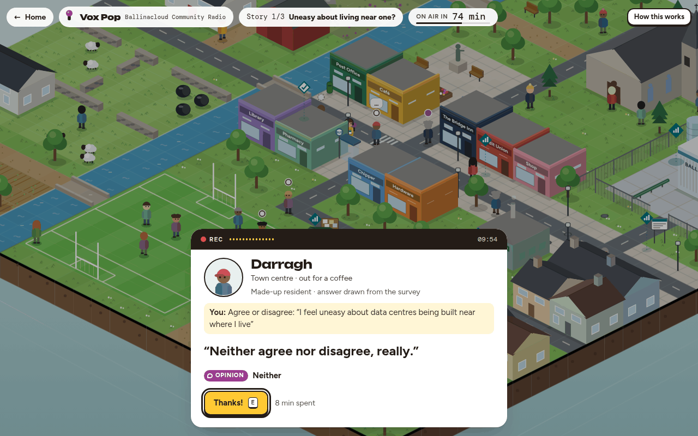
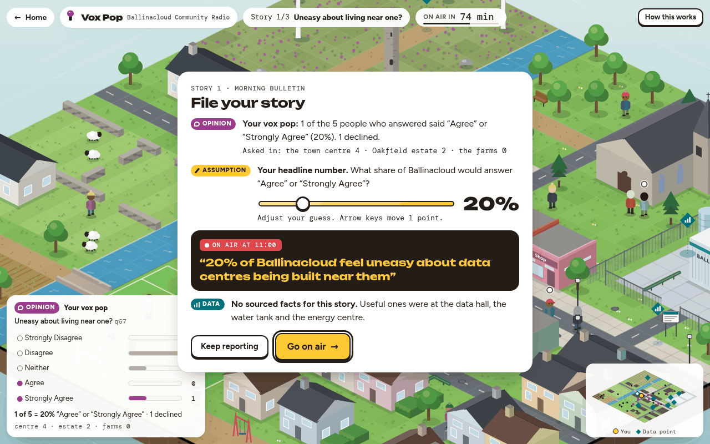
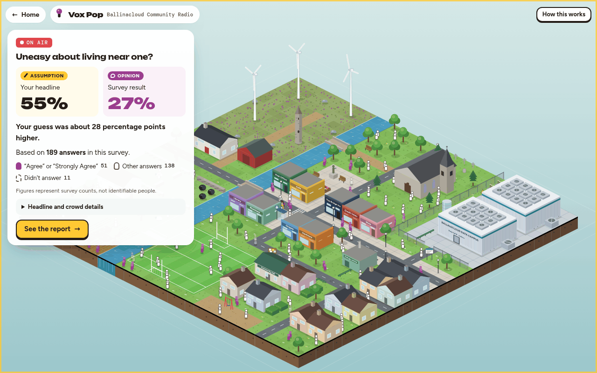
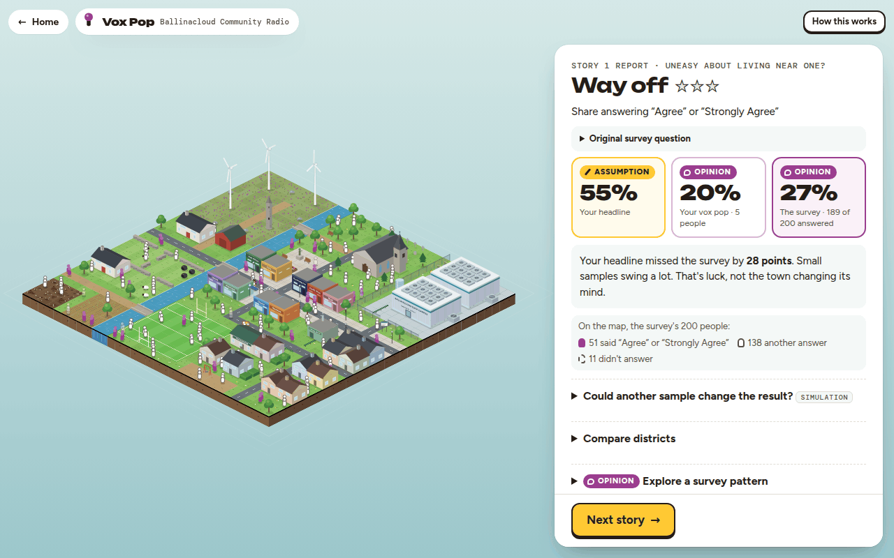
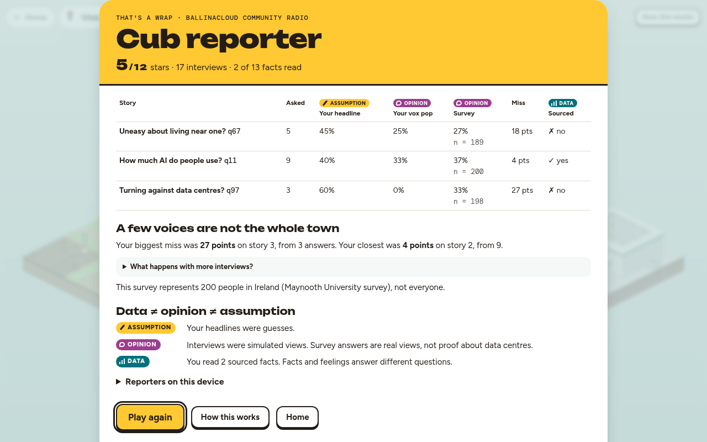

# Vox Pop

**Behind the Headlines · BU Induction Hack 2026**



You are a local-radio reporter in Ballinacloud, a made-up Irish town next to a data-centre campus. Interview a handful of residents, guess what the whole town thinks, then meet the real survey of 200 people in Ireland (Maynooth University survey) and see how far a small sample can drift. The thread running through it all: **DATA ≠ OPINION ≠ ASSUMPTION**.

**[Play in your browser](https://madara88645.github.io/behind-the-headlines/vox-pop.html)** · [Home page](https://madara88645.github.io/behind-the-headlines/) · [Watch story 1 played through (90 s)](docs/media/vox-pop-demo.mp4)

## Play

- **Online:** open the home page at <https://madara88645.github.io/behind-the-headlines/>, or go straight to the game at <https://madara88645.github.io/behind-the-headlines/vox-pop.html>.
- **Offline:** on GitHub, click **Code → Download ZIP**, unzip it and double-click `index.html`. It runs from `file://` in Chrome and Safari: no install, no server, no account.
- A full run is three short stories, about five minutes. Fonts come from Google Fonts; offline, the game falls back to your system fonts.
- Want to watch first? Here is a [90-second video of the first story (MP4)](docs/media/vox-pop-demo.mp4).

## How it plays

The reporter's phone explains it in three steps:

1. **Ask**: interview people around town.
2. **Guess**: what does the whole town think?
3. **Compare**: check your guess against a real survey.

<table>
  <tr>
    <td width="50%" valign="top"><br><sub><b>Start.</b> Your editor's phone: how to play in three steps.</sub></td>
    <td width="50%" valign="top"><br><sub><b>Walk.</b> Find people to interview around town.</sub></td>
  </tr>
  <tr>
    <td width="50%" valign="top"><br><sub><b>Interview.</b> Each answer is drawn from the survey.</sub></td>
    <td width="50%" valign="top"><br><sub><b>File.</b> Set your headline number with a slider.</sub></td>
  </tr>
  <tr>
    <td width="50%" valign="top"><br><sub><b>On air.</b> Meet the 200: one figure per survey respondent.</sub></td>
    <td width="50%" valign="top"><br><sub><b>Report.</b> Your headline vs your vox pop vs the survey.</sub></td>
  </tr>
</table>

### The full flow

- **Brief.** Maura, your editor, texts you the story. You reply with one of two questions, each built from the survey's own wording. A *No deadline* switch stops the clock if you want to take your time.
- **Reporting.** Walk around Ballinacloud: the town centre, the Oakfield estate, the farms and the campus. Interview residents and read the teal data points. With the deadline on, walking, interviews and data points all use up the two game hours before you go on air. (You can try the sheep. They weren't in the survey.)
- **File.** You see what your vox pop said. Drag the slider to set your headline number, and the headline sentence writes itself.
- **On air: meet the 200.** Your headline goes out next to the survey result. The camera pulls back and 200 figures pop up across the districts, one per survey respondent, placed by the real counts.
- **Report.** Your headline, your vox pop and the survey side by side, with stars for accuracy. Then *100 parallel vox pops*, a district comparison, for some questions a survey pattern to explore, and the facts you found or missed.
- **Three stories.** *The new hall* (morning), *Life online* (lunchtime) and *The six o'clock news* (evening, when the street lamps come on).
- **End screen.** Your rank, a table of your three stories, the lesson from your own run, a DATA / OPINION / ASSUMPTION recap, every source you were shown, and *Play again* (a new day with new residents).

### Controls

| Action | Keyboard | Mouse |
|---|---|---|
| Walk | Arrow keys or <kbd>W</kbd> <kbd>A</kbd> <kbd>S</kbd> <kbd>D</kbd> | Click where you want to go |
| Interview someone / read a data point | <kbd>E</kbd> (or <kbd>Enter</kbd> / <kbd>Space</kbd>) | Click the person or marker, or the *Interview* / *Read* button |
| Open or close the notebook | <kbd>N</kbd> | *Notebook* button |
| File your story | <kbd>F</kbd> | *File story* button |
| Set your headline number | Arrow keys on the slider | Drag the slider |
| Close a panel | <kbd>Esc</kbd> | The panel's button |

At any time, *How this works* (top right) explains the rules, the scoring and where the residents' answers come from.

## What it shows

- **DATA**: measured, with a source you can check. In the game, the facts at the teal data points, each with its source link.
- **OPINION**: what people say they think. In the game, your interviews (simulated from the survey) and the survey's answers (real views, but not proof about data centres).
- **ASSUMPTION**: your own guess. In the game, the headline number you file.

A vox pop is a tiny sample. After each story, **100 parallel vox pops** show what 100 imaginary reporters would have got by asking as many random residents as you did, with answers drawn the same way. The spread shows how far a handful of answers moves by luck alone, and how much tighter it gets with 30 people each. **Compare districts** sets where you asked next to the survey's split by area type (q4), because where you ask changes what you hear. The first is labelled as a simulation and the second as a pattern, not a cause. Each one comes with a note on where its numbers come from.



## The data

**The survey:** *Social Acceptance of Sustainable Data Centres in Ireland*, a Maynooth University survey of 200 people in Ireland with 104 questions, supplied for the hackathon. The game always says "in this survey", never "Ireland thinks".

- **Aggregated only.** `tools/extract_survey.py` reads the original spreadsheet and writes only answer totals and two-way cross-tabs. No individual response is in this repo: the timestamp and any identifying or free-text columns are dropped.
- **Small groups are flagged.** Cross-tab cells with only 1 or 2 people are hidden (a true 0 stays 0), and the game says "too few people to show" for them. Groups under 30 people get a "small group (n = X)" note.
- **Patterns, not causes.** Wherever the game shows a cross-tab, it says so.
- **Percentages are of the people who answered** that question, and the game shows that n.
- **The residents are made up.** Their answers are drawn at random from the survey's answer shares for people from the same kind of area (the q4 cross-tab). Answers to different questions are drawn separately, because the survey file does not link one person's answers.

### Survey questions Vox Pop uses

| Where | Question | Id |
|---|---|---|
| The town's three districts and every resident's answer | How would you describe your local area? (urban, suburban, rural) | q4 |
| Story 1 · The new hall (pick one) | Uneasy about data centres being built near where I live · A data centre within 5 km of home | q67, q77 |
| Story 2 · Life online (pick one) | How often people use AI tools · streaming services | q11, q8 |
| Story 3 · The six o'clock news (two of three offered) | View change over the past two years · keep attracting data-centre investment · benefits can outweigh costs | q97, q99, q104 |
| Report: survey patterns | A data centre within 10 km of home (with q67, q77) · overall attitude by AI-tool use (with q11) | q7, q96 |

### Facts on the map

All from `data/facts.js`, each shown in the game with its source link and a confidence note.

| Data point | Topic | Source |
|---|---|---|
| Data hall | Data centres' share of Ireland's metered electricity, with a 2015-2025 chart | CSO |
| Substation | Projected share of electricity demand by 2034 | CRU |
| Planning notice | Conditions for new data-centre grid connections (Dec 2025) | CRU via RTÉ |
| Water tank | Data-centre water use | Uisce Éireann via TheJournal.ie |
| Energy centre | Waste heat warming buildings in Tallaght | SEAI |
| Wind farm | Wind energy dispatched down · renewable share of electricity | EirGrid · SEAI |
| Library | Energy per AI prompt · streaming's carbon footprint · global demand to 2030 | Google · IEA |
| Credit union | Economic value and jobs | KPMG for the Department of Enterprise |
| Community noticeboard | Estimated cost to household bills (advocacy-group modelling, flagged as low confidence) | Friends of the Earth Ireland |

## How it's built

- **Plain HTML, CSS and JavaScript.** No framework, no build step, no npm, no dependencies, no backend and no analytics.
- **Runs from `file://`.** Classic `<script src>` tags only: no `fetch()` of local files and no modules.
- **An isometric canvas renderer.** `world.js` holds the 32 × 32 tile town, its districts and A* pathfinding. `art.js` draws every building, person and sheep with canvas paths, so there are no image files.
- **No survey number is typed in.** Every one is computed when the page loads, from `data/survey_stats.js` through `shared/survey.js`. Facts come only from `data/facts.js`.
- **Accessible.** It is fully keyboard playable with real buttons and a visible focus ring. It has a skip link, screen-reader announcements (who is nearby, each answer, the on-air result) and text alternatives for the charts. Labels always pair an icon with a word, never colour alone. It respects `prefers-reduced-motion`, and the *No deadline* mode removes time pressure.
- **Your runs stay on your device.** Finished runs are saved only in `localStorage` ("Reporters on this device"). It is not a live poll.

## Project structure

```
index.html              home page: what Vox Pop is, screenshots, the idea, sources
vox-pop.html            the game page
games/vox-pop/
  game.js               game flow: phone, reporting, on air, report, end, help
  sim.js                survey -> residents' answers, the crowd, the simulation
  people.js             the made-up residents and sheep
  world.js              town map: buildings, districts, data points, pathfinding
  art.js                canvas drawing of the town, people and markers
  style.css             the game's look
data/
  survey_stats.js       aggregated survey, generated -> window.SURVEY_STATS
  survey_stats.json     the same data as JSON, for inspection
  survey_digest.txt     every question and its answer shares, as plain text
  survey_insights.txt   a few notable cross-tab findings
  facts.js              checked facts, each with a source URL -> window.DC_FACTS
shared/survey.js        small read-only helper over the survey -> window.Survey
docs/
  specs/vox-pop.md      the game design spec
  BUILD_RULES.md        the build checklist
  media/                screenshots, demo GIF and videos
tools/
  extract_survey.py     rebuilds data/survey_stats.* from the spreadsheet
  qa_shot.sh            headless-Chrome screenshot and console-error check (macOS)
AGENTS.md, CLAUDE.md    guide for AI coding assistants
LICENSE                 MIT for the code and docs, and what it does not cover
.nojekyll               lets GitHub Pages serve the files as they are
```

**Why the pages sit in the root:** Safari only lets a page opened from disk (`file://`) load files from its own folder and the folders below it. The game needs `data/` and `shared/`, so its page lives next to those folders. Don't move it into `games/`.

## For developers

- **Debug screens.** Add `#screen=<name>` to jump to any screen with sample answers, for example `vox-pop.html#screen=report`. The names are `start`, `brief`, `brief2`, `first-walk`, `play`, `talk`, `fact`, `notebook`, `file`, `crowd`, `report`, `end`, `help` and `evening`. Normal play is unaffected.
- **Local server** (optional, e.g. to test on a phone on the same Wi-Fi). Run this from the project folder, then open <http://localhost:8765/>:
  ```bash
  python3 -m http.server 8765
  ```
- **Rebuild the survey data** from the original spreadsheet export (Python 3, standard library only). Without a path, it looks for the export under its original file name in `~/Downloads`:
  ```bash
  python3 tools/extract_survey.py path/to/responses.xlsx
  ```
  The spreadsheet is not in this repo and must never be committed (`.xlsx` and `.csv` files are git-ignored).
- **Checks before a pull request:**
  ```bash
  for f in games/vox-pop/*.js; do node --check "$f"; done
  # must print nothing:
  grep -n '\.\./' index.html vox-pop.html
  # screenshot + console errors (macOS with Google Chrome):
  tools/qa_shot.sh vox-pop.html /tmp/shot.png 1280 800 "#screen=end"
  ```
  Then double-click `vox-pop.html` and play to the end in Safari and in Chrome.
- **Workflow.** `main` always works. Make a branch, open a pull request, and let a teammate play it before merging.
- **AI assistants** should follow [AGENTS.md](AGENTS.md). Claude Code reads it through `CLAUDE.md`.

## Team

Made by **Mehmet Özel** ([@madara88645](https://github.com/madara88645)), **Yavuz Aydın** ([@yavuzaydn](https://github.com/yavuzaydn)) and **İbrahim Yılmaz** at the BU (Bournemouth University) Induction Hack 2026, for the brief *"Data centres: behind the headlines - make data playable"*.

## Credits and sources

- **Survey:** *Social Acceptance of Sustainable Data Centres in Ireland*, Maynooth University (200 people in Ireland, 104 questions), supplied for the BU Induction Hack 2026.
- [Central Statistics Office (CSO): Data Centres Metered Electricity Consumption 2025](https://www.cso.ie/en/releasesandpublications/ep/p-dcmec/datacentresmeteredelectricityconsumption2025/keyfindings/)
- [Commission for Regulation of Utilities (CRU): connection policy for data centres](https://www.cru.ie/about-us/news/the-cru-publishes-its-decision-on-new-electricity-connection-policy-for-data-centres/), with [RTÉ News on the decision](https://www.rte.ie/news/business/2025/1212/1548674-80-of-data-centre-energy-must-come-from-renewables-cru/)
- [SEAI: renewables statistics](https://www.seai.ie/data-and-insights/seai-statistics/renewables) and [Tallaght District Heating case study](https://www.seai.ie/case-studies/tallaght-district-heating)
- [EirGrid: Annual Renewable Constraint and Curtailment Report 2024](https://cms.eirgrid.ie/sites/default/files/publications/Annual-Renewable-Constraint-and-Curtailment-Report-2024-V1.0.pdf)
- [Uisce Éireann figures, reported by TheJournal.ie](https://www.thejournal.ie/ireland-data-centre-water-use-7137959-Aug2026/)
- [KPMG for the Department of Enterprise: The value of data centres to Ireland (2026)](https://enterprise.gov.ie/en/publications/publication-files/the-value-of-data-centres-to-ireland.pdf)
- [IEA: Energy and AI](https://www.iea.org/reports/energy-and-ai/energy-demand-from-ai) and [IEA: the carbon footprint of streaming video](https://www.iea.org/commentaries/the-carbon-footprint-of-streaming-video-fact-checking-the-headlines)
- [Google: energy and water per Gemini text prompt (arXiv, 2025)](https://arxiv.org/pdf/2508.15734)
- [Friends of the Earth Ireland: the cost of data-centre growth](https://www.friendsoftheearth.ie/news/the-cost-of-data-centre-growth-in-ireland-households-paid-an-estimated-715-million-more-in-electrici/)
- **Fonts:** [Unbounded](https://fonts.google.com/specimen/Unbounded), [Figtree](https://fonts.google.com/specimen/Figtree), [DM Mono](https://fonts.google.com/specimen/DM+Mono) and [Kalam](https://fonts.google.com/specimen/Kalam) from Google Fonts, under the SIL Open Font License.

The game's end screen lists the exact sources you were shown in your run.

## License

The code and documentation are released under the [MIT License](LICENSE). The survey data in `data/` (Maynooth University) and the third-party facts and news claims in `data/facts.js` are not covered by it; they belong to their owners. The fonts are used under their own licences.
